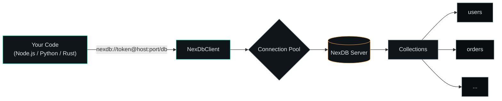
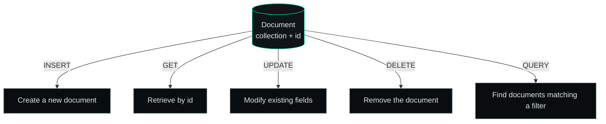
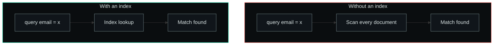
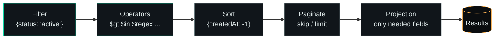

<div align="center">

# NexDB

**A fast, embeddable document database with a simple SDK for Node.js, Python, and Rust.**


*For installation and server setup, see the [main README](../README.md).*

</div>

---

## Table of Contents

| # | Section | What you'll find |
|---|---------|-------------------|
| 1 | [Connection Management](#connection-management) | Connection URLs, SDK clients, pooling |
| 2 | [Basic Operations](#basic-operations) | The five core operations at a glance |
| 3 | [Write Operations](#write-operations) | Insert, batch insert, transactions |
| 4 | [Read Operations](#read-operations) | Get, list, pagination |
| 5 | [Update Operations](#update-operations) | Full/partial updates, atomic ops |
| 6 | [Delete Operations](#delete-operations) | Delete, bulk delete, soft delete |
| 7 | [Indexing](#indexing) | Single, compound, unique indexes |
| 8 | [Querying](#querying) | Operators, sorting, aggregation |
| 9 | [Authentication](#authentication) | Tokens, rotation, multi-user |
| 10 | [Error Handling](#error-handling) | Error codes, retries |
| 11 | [Performance Optimization](#performance-optimization) | Indexes, batching, caching |
| 12 | [Troubleshooting](#troubleshooting) | Common issues and fixes |

---

## How NexDB fits together



Every operation in this guide flows through the same pattern: **open a client → authenticate via the connection URL → operate on a collection**.

---

## Connection Management

### Connection URL Format

```
nexdb://<auth_token>@<host>:<port>/<database_name>
```

#### Components

| Component | Description | Example |
|-----------|-------------|---------|
| `auth_token` | Authentication token | `secrettoken` |
| `host` | Server hostname/IP | `127.0.0.1` or `localhost` |
| `port` | Server port | `27017` |
| `database_name` | Logical database name | `my_app`, `production_db` |

#### Connection Examples

```
nexdb://secrettoken@127.0.0.1:27017/my_app
nexdb://mytoken@db.example.com:27017/users_db
nexdb://admin@localhost:5000/test_db
```

### Node.js Connection

```javascript
const { NexDbClient } = require('nexdb-sdk');

// Create client instance
const db = new NexDbClient('nexdb://secrettoken@127.0.0.1:27017/my_app');

// Connect to server
try {
  await db.connect();
  console.log('Connected to NexDB');
} catch (error) {
  console.error('Connection failed:', error.message);
}

// Perform operations...

// Disconnect when done
await db.disconnect();
```

### Python Connection

```python
from nexdb import NexDbClient

# Create client instance
db = NexDbClient('nexdb://secrettoken@127.0.0.1:27017/my_app')

# Connect to server
try:
    db.connect()
    print('Connected to NexDB')
except Exception as e:
    print(f'Connection failed: {e}')

# Perform operations...

# Disconnect when done
db.disconnect()
```

### Rust Embedded Connection

```rust
use nexdb::NexDb;

#[tokio::main]
async fn main() -> Result<()> {
    // Open embedded database (no TCP overhead)
    let db = NexDb::open("./my_database").await?;
    
    // Use database directly
    
    Ok(())
}
```

### Connection Pooling (Node.js)

```javascript
const { NexDbClient } = require('nexdb-sdk');

// Create pool for multiple concurrent operations
const db = new NexDbClient(
  'nexdb://secrettoken@127.0.0.1:27017/my_app',
  { poolSize: 10 }
);

await db.connect();

// Connections are automatically managed from the pool
```

---

## Basic Operations

The fundamental operations in NexDB revolve around a single document, identified by its `id` inside a collection:



| Operation | Method | Returns |
|-----------|--------|---------|
| **INSERT** | `db.insert(collection, id, doc)` | Insert metadata |
| **GET** | `db.get(collection, id)` | The document, or `null` |
| **UPDATE** | `db.update` / `db.updatePartial` | Updated document |
| **DELETE** | `db.delete(collection, id)` | `true` / `false` |
| **QUERY** | `db.query(collection, filter, options)` | Array of documents |

---

## Write Operations

### Insert Single Document

Insert a new document into a collection.

#### Node.js

```javascript
const result = await db.insert('users', 'u101', {
  name: 'Ansh Kumar',
  email: 'ansh@example.com',
  status: 'active',
  age: 28,
  createdAt: new Date()
});

console.log(result); 
// { id: 'u101', status: 'success', timestamp: '2024-01-15T10:30:00Z' }
```

#### Python

```python
result = db.insert('users', 'u101', {
    'name': 'Ansh Kumar',
    'email': 'ansh@example.com',
    'status': 'active',
    'age': 28,
    'createdAt': datetime.now()
})

print(result)
# {'id': 'u101', 'status': 'success', 'timestamp': '2024-01-15T10:30:00Z'}
```

#### Rust

```rust
db.insert("users", "u101", serde_json::json!({
    "name": "Ansh Kumar",
    "email": "ansh@example.com",
    "status": "active",
    "age": 28,
    "createdAt": chrono::Local::now()
})).await?;
```

### Batch Insert

Insert multiple documents efficiently.

#### Node.js

```javascript
const documents = [
  { id: 'u101', name: 'Ansh', email: 'ansh@example.com' },
  { id: 'u102', name: 'Priya', email: 'priya@example.com' },
  { id: 'u103', name: 'Raj', email: 'raj@example.com' }
];

const results = await db.batchInsert('users', documents);
console.log(`Inserted ${results.length} documents`);
```

#### Python

```python
documents = [
    {'id': 'u101', 'name': 'Ansh', 'email': 'ansh@example.com'},
    {'id': 'u102', 'name': 'Priya', 'email': 'priya@example.com'},
    {'id': 'u103', 'name': 'Raj', 'email': 'raj@example.com'}
]

results = db.batch_insert('users', documents)
print(f"Inserted {len(results)} documents")
```

### Bulk Insert with Transaction

```javascript
// All documents inserted atomically or none at all
try {
  await db.beginTransaction();
  
  for (const doc of documents) {
    await db.insert('users', doc.id, doc);
  }
  
  await db.commit();
} catch (error) {
  await db.rollback();
  throw error;
}
```

### Document Structure

Documents can contain:
- **Primitives**: strings, numbers, booleans, null
- **Objects**: nested JSON objects
- **Arrays**: lists of values
- **Special types**: dates, timestamps, binary data

```javascript
const user = {
  // Basic fields
  id: 'u101',
  name: 'Ansh Kumar',
  email: 'ansh@example.com',
  
  // Numbers
  age: 28,
  score: 95.5,
  
  // Booleans
  isActive: true,
  isVerified: false,
  
  // Nested objects
  address: {
    street: '123 Main St',
    city: 'San Francisco',
    country: 'USA'
  },
  
  // Arrays
  tags: ['developer', 'rust', 'database'],
  hobbies: [
    { name: 'coding', level: 'expert' },
    { name: 'reading', level: 'intermediate' }
  ],
  
  // Dates
  createdAt: new Date(),
  updatedAt: new Date()
};

await db.insert('users', 'u101', user);
```

---

## Read Operations

### Get Single Document

Retrieve a document by its ID.

#### Node.js

```javascript
const user = await db.get('users', 'u101');

if (user) {
  console.log(user);
  // { id: 'u101', name: 'Ansh Kumar', email: 'ansh@example.com', ... }
} else {
  console.log('Document not found');
}
```

#### Python

```python
user = db.get('users', 'u101')

if user:
    print(user)
else:
    print('Document not found')
```

#### Rust

```rust
match db.get("users", "u101").await? {
    Some(doc) => println!("{:?}", doc),
    None => println!("Document not found"),
}
```

### Get Multiple Documents

#### Node.js

```javascript
const ids = ['u101', 'u102', 'u103'];
const users = await db.getMultiple('users', ids);

console.log(users); // Array of documents
```

### List All Documents in Collection

```javascript
const allUsers = await db.list('users');
console.log(`Found ${allUsers.length} users`);
```

### Pagination

```javascript
const pageSize = 20;
const pageNumber = 1;

const page = await db.list('users', {
  skip: (pageNumber - 1) * pageSize,
  limit: pageSize
});

console.log(`Page ${pageNumber}: ${page.length} results`);
```

---

## Update Operations

### Update Entire Document

Replace the entire document with new content.

#### Node.js

```javascript
const updated = await db.update('users', 'u101', {
  name: 'Ansh Kumar Updated',
  email: 'newemail@example.com',
  status: 'inactive'
});

console.log(updated);
```

#### Python

```python
updated = db.update('users', 'u101', {
    'name': 'Ansh Kumar Updated',
    'email': 'newemail@example.com',
    'status': 'inactive'
})
```

### Partial Update (Merge)

Update only specific fields while preserving others.

#### Node.js

```javascript
// Merge only these fields into existing document
const updated = await db.updatePartial('users', 'u101', {
  status: 'inactive',
  lastLogin: new Date()
});

// Original fields like 'name' and 'email' are preserved
```

#### Python

```python
updated = db.update_partial('users', 'u101', {
    'status': 'inactive',
    'lastLogin': datetime.now()
})
```

### Update with Conditions

```javascript
// Update only if current value matches
const updated = await db.updateIf('users', 'u101', 
  { status: 'inactive' },  // Update these fields
  { status: 'active' }      // Only if current status is 'active'
);
```

### Atomic Field Operations

#### Increment a number

```javascript
await db.increment('users', 'u101', 'score', 10);
```

#### Append to array

```javascript
await db.appendToArray('users', 'u101', 'tags', 'new-tag');
```

#### Push to nested array

```javascript
await db.appendToArray('users', 'u101', 'hobbies', {
  name: 'gaming',
  level: 'beginner'
});
```

### Batch Updates

```javascript
const updates = [
  { id: 'u101', data: { status: 'inactive' } },
  { id: 'u102', data: { status: 'active' } },
  { id: 'u103', data: { status: 'pending' } }
];

const results = await db.batchUpdate('users', updates);
```

---

## Delete Operations

### Delete Single Document

#### Node.js

```javascript
const deleted = await db.delete('users', 'u101');

if (deleted) {
  console.log('Document deleted successfully');
} else {
  console.log('Document not found');
}
```

#### Python

```python
deleted = db.delete('users', 'u101')

if deleted:
    print('Document deleted successfully')
else:
    print('Document not found')
```

### Delete Multiple Documents

#### Node.js

```javascript
const ids = ['u101', 'u102', 'u103'];
const deletedCount = await db.deleteMultiple('users', ids);

console.log(`Deleted ${deletedCount} documents`);
```

### Delete All Documents in Collection

```javascript
const deletedCount = await db.deleteAll('users');
console.log(`Cleared ${deletedCount} documents from users collection`);
```

### Delete with Condition

```javascript
// Delete all inactive users
const deletedCount = await db.deleteWhere('users', {
  status: 'inactive'
});
```

### Soft Delete (Mark as Deleted)

Instead of removing documents, mark them as deleted:

```javascript
await db.updatePartial('users', 'u101', {
  deleted: true,
  deletedAt: new Date()
});

// Later, query only non-deleted documents
const activeUsers = await db.query('users', {
  deleted: { $ne: true }
});
```

---

## Indexing

Indexes dramatically improve query performance.



A full scan checks every document one by one; an index jumps straight to the match — this is the difference between an `O(n)` and roughly `O(log n)` lookup.

### Create Index on Field

#### Node.js

```javascript
// Create index on email field
await db.createIndex('users', 'email');

// Create compound index
await db.createIndex('users', ['email', 'status']);
```

#### Python

```python
db.create_index('users', 'email')
db.create_index('users', ['email', 'status'])
```

### List Indexes

```javascript
const indexes = await db.listIndexes('users');
console.log(indexes);
// ['email', 'status', 'createdAt']
```

### Drop Index

```javascript
await db.dropIndex('users', 'email');
```

### Index Types

#### Single Field Index

```javascript
// Best for exact matches and sorting
await db.createIndex('users', 'email');
await db.createIndex('users', 'status');
```

#### Compound Index

```javascript
// Best for queries filtering by multiple fields
await db.createIndex('users', ['status', 'createdAt']);
```

#### Unique Index

```javascript
// Ensures no duplicate values
await db.createIndex('users', 'email', { unique: true });
```

### Index Considerations

| Create an index when | Skip the index when |
|---|---|
| Field is used in filters (WHERE) | Collection is small (< 1000 docs) |
| Field is used for sorting (ORDER BY) | Field has low cardinality (few unique values) |
| Field is used to join collections | Field is updated very frequently |
| Field has high cardinality (many unique values) | Field is rarely queried |

---

## Querying

### Query Pipeline

A query flows through the same stages every time — filter first, then shape the output:



### Simple Query (Equal Match)

#### Node.js

```javascript
// Find users where status is 'active'
const activeUsers = await db.query('users', {
  status: 'active'
});

console.log(`Found ${activeUsers.length} active users`);
```

#### Python

```python
active_users = db.query('users', {'status': 'active'})
print(f"Found {len(active_users)} active users")
```

### Query with Operators

#### Comparison Operators

```javascript
// Greater than
const youngerUsers = await db.query('users', {
  age: { $gt: 18 }
});

// Less than
const juniorsUsers = await db.query('users', {
  age: { $lt: 25 }
});

// Greater than or equal
const adultsUsers = await db.query('users', {
  age: { $gte: 18 }
});

// Less than or equal
const seniorUsers = await db.query('users', {
  age: { $lte: 60 }
});

// Not equal
const inactiveUsers = await db.query('users', {
  status: { $ne: 'active' }
});
```

#### Logical Operators

```javascript
// AND - all conditions must match
const results = await db.query('users', {
  status: 'active',
  age: { $gte: 18 }
});

// OR - any condition can match
const results = await db.query('users', {
  $or: [
    { status: 'active' },
    { status: 'pending' }
  ]
});

// NOT - negate condition
const results = await db.query('users', {
  status: { $not: { $eq: 'inactive' } }
});
```

#### Array Operators

```javascript
// IN - match any value in array
const results = await db.query('users', {
  status: { $in: ['active', 'pending'] }
});

// NOT IN
const results = await db.query('users', {
  status: { $nin: ['deleted', 'suspended'] }
});

// Contains element in array
const results = await db.query('users', {
  tags: { $contains: 'developer' }
});
```

#### String Operators

```javascript
// Starts with
const results = await db.query('users', {
  email: { $startsWith: 'admin' }
});

// Ends with
const results = await db.query('users', {
  email: { $endsWith: '@example.com' }
});

// Contains substring
const results = await db.query('users', {
  name: { $contains: 'Kumar' }
});

// Regex match
const results = await db.query('users', {
  email: { $regex: '^[a-z]+@example\\.com$' }
});
```

### Complex Queries

```javascript
// Multiple conditions
const results = await db.query('users', {
  status: 'active',
  age: { $gte: 18, $lt: 65 },
  $or: [
    { role: 'admin' },
    { role: 'moderator' }
  ]
});
```

### Query with Sorting

```javascript
// Sort by single field
const results = await db.query('users', 
  { status: 'active' },
  { sort: { createdAt: -1 } }  // -1 for desc, 1 for asc
);

// Sort by multiple fields
const results = await db.query('users',
  { status: 'active' },
  { sort: { status: 1, createdAt: -1 } }
);
```

### Query with Pagination

```javascript
const pageSize = 20;
const pageNum = 2;

const results = await db.query('users',
  { status: 'active' },
  {
    skip: (pageNum - 1) * pageSize,
    limit: pageSize,
    sort: { createdAt: -1 }
  }
);
```

### Query with Projection

Return only specific fields:

```javascript
const results = await db.query('users',
  { status: 'active' },
  {
    projection: {
      id: 1,
      name: 1,
      email: 1
      // Other fields excluded
    }
  }
);
```

### Count Query

```javascript
const count = await db.count('users', { status: 'active' });
console.log(`${count} active users`);
```

### Aggregation Queries

#### Sum

```javascript
const totalScore = await db.aggregate('users', {
  type: 'sum',
  field: 'score',
  match: { status: 'active' }
});
```

#### Average

```javascript
const avgAge = await db.aggregate('users', {
  type: 'avg',
  field: 'age'
});
```

#### Min/Max

```javascript
const oldest = await db.aggregate('users', {
  type: 'max',
  field: 'age'
});

const youngest = await db.aggregate('users', {
  type: 'min',
  field: 'age'
});
```

#### Group By

```javascript
const byStatus = await db.aggregate('users', {
  type: 'group',
  groupBy: 'status',
  count: true
});

// Result: { active: 150, inactive: 30, pending: 20 }
```

---

## Authentication

### Token-Based Authentication

All connections require an authentication token.

### Generate Token

The token can be any string. In production, use secure tokens:

```javascript
// Example secure token generation (Node.js)
const crypto = require('crypto');
const token = crypto.randomBytes(32).toString('hex');
console.log(token);
// Output: a7f3e8b2c1d9f4e6a7c9e2f1b8d3a4c5e6f7a8b9c0d1e2f3a4b5c6d7e8f9
```

### Using Tokens

Include token in connection URL:

```
nexdb://your_token_here@localhost:27017/database_name
```

### Token Management

```javascript
// Rotate token (invalidate old, create new)
const newToken = crypto.randomBytes(32).toString('hex');

// Update connection
const newDb = new NexDbClient(
  `nexdb://${newToken}@localhost:27017/database_name`
);
```

### Multi-User Authentication

Each connection can have different tokens:

```javascript
// Admin user
const adminDb = new NexDbClient('nexdb://admin_token@localhost:27017/db');

// Regular user
const userDb = new NexDbClient('nexdb://user_token@localhost:27017/db');
```

---

## Error Handling

### Try-Catch Pattern

#### Node.js

```javascript
try {
  const user = await db.get('users', 'u101');
} catch (error) {
  if (error.code === 'NOT_FOUND') {
    console.log('User not found');
  } else if (error.code === 'CONNECTION_FAILED') {
    console.log('Cannot connect to database');
  } else {
    console.error('Unexpected error:', error.message);
  }
}
```

#### Python

```python
try:
    user = db.get('users', 'u101')
except NotFoundError:
    print('User not found')
except ConnectionError:
    print('Cannot connect to database')
except Exception as e:
    print(f'Unexpected error: {e}')
```

### Common Error Codes

| Error Code | Meaning | Resolution |
|-----------|---------|-----------|
| `NOT_FOUND` | Document doesn't exist | Check ID is correct |
| `CONNECTION_FAILED` | Can't connect to server | Verify server running, host, port |
| `AUTHENTICATION_FAILED` | Invalid token | Check authentication token |
| `DUPLICATE_KEY` | Key already exists (unique index) | Use different ID or update instead |
| `VALIDATION_ERROR` | Invalid data format | Check document structure |
| `TIMEOUT` | Operation took too long | Optimize query or increase timeout |
| `STORAGE_ERROR` | Disk write failure | Check disk space, permissions |

### Error Recovery

```javascript
// Retry logic
async function queryWithRetry(collection, filter, maxRetries = 3) {
  for (let i = 0; i < maxRetries; i++) {
    try {
      return await db.query(collection, filter);
    } catch (error) {
      if (i === maxRetries - 1) throw error;
      
      // Wait before retry (exponential backoff)
      const delay = Math.pow(2, i) * 1000;
      await new Promise(r => setTimeout(r, delay));
    }
  }
}

const results = await queryWithRetry('users', { status: 'active' });
```

---

## Performance Optimization

### Query Optimization

#### Use Indexes

```javascript
// Good - uses index
const users = await db.query('users', { email: 'user@example.com' });

// Bad - full table scan
const users = await db.query('users', { address: { city: 'NYC' } });
// Solution: create index on address.city
```

#### Pagination for Large Results

```javascript
// Bad - loads all 1 million documents
const allUsers = await db.list('users');

// Good - loads 20 at a time
const page1 = await db.list('users', { skip: 0, limit: 20 });
const page2 = await db.list('users', { skip: 20, limit: 20 });
```

#### Use Projection

```javascript
// Bad - returns all fields
const results = await db.query('users', { status: 'active' });

// Good - returns only needed fields
const results = await db.query('users', { status: 'active' }, {
  projection: { id: 1, email: 1, name: 1 }
});
```

### Batch Operations

```javascript
// Bad - 1000 individual requests
for (const doc of documents) {
  await db.insert('users', doc.id, doc);
}

// Good - single batch operation
await db.batchInsert('users', documents);
```

### Connection Pooling

```javascript
// Create pool for concurrent operations
const db = new NexDbClient(connectionUrl, {
  poolSize: 20,
  maxWaitTime: 5000
});
```

### Write-Ahead Logging (WAL)

NexDB automatically uses WAL for durability:

```javascript
// All writes are automatically logged to disk
// Even if server crashes, data is recoverable
await db.insert('users', 'u101', { name: 'Ansh' });
```

### Cache Management

```javascript
// For frequently accessed data, implement caching
const cache = new Map();

async function getCachedUser(id) {
  if (cache.has(id)) {
    return cache.get(id);
  }
  
  const user = await db.get('users', id);
  cache.set(id, user);
  return user;
}
```

---

## Troubleshooting

### Connection Failures

**Problem:** `Cannot connect to database server`

**Solutions:**
```javascript
// Verify server is running
// Check host and port in connection URL
const db = new NexDbClient('nexdb://token@127.0.0.1:27017/db');

// Verify firewall allows connections
// Check logs for auth errors
```

### Slow Queries

**Problem:** Queries are taking too long

**Solutions:**
```javascript
// 1. Create indexes on frequently queried fields
await db.createIndex('users', 'email');
await db.createIndex('users', 'status');

// 2. Use pagination
await db.query('users', filter, { limit: 100 });

// 3. Use projection to fetch fewer fields
await db.query('users', filter, { projection: { id: 1, name: 1 } });

// 4. Check query plan (if available)
const plan = await db.explainQuery('users', filter);
```

### Out of Memory

**Problem:** Server consuming too much memory

**Solutions:**
```javascript
// 1. Reduce in-memory cache
// 2. Use smaller page sizes
await db.query('users', filter, { limit: 50 });

// 3. Close unused connections
await db.disconnect();

// 4. Monitor memory usage
// Check system resources with top, htop, etc.
```

### Data Corruption

**Problem:** Corrupted files after crash

**Solutions:**
- NexDB has automatic recovery via Write-Ahead Logging (WAL) — restarting the server replays the WAL
- Back up your data directory regularly (`cp -r ./data_dir ./data_dir.backup`)
- Run an integrity check on the data directory if available

### Authentication Issues

**Problem:** `Authentication failed` errors

**Solutions:**
```javascript
// 1. Verify token is correct
const correctUrl = 'nexdb://exact_token@host:port/db';

// 2. Check token contains no special characters that need escaping
// 3. Ensure token matches server configuration
// 4. Regenerate token if forgotten
```

---

## Best Practices

| # | Practice | Why it matters |
|---|----------|-----------------|
| 1 | Always close connections when done | Frees server-side resources |
| 2 | Index frequently queried fields | Turns full scans into direct lookups |
| 3 | Paginate large result sets | Avoids loading millions of docs into memory |
| 4 | Wrap operations in try-catch | Fails predictably instead of crashing |
| 5 | Use batch operations instead of loops | One round trip instead of N |
| 6 | Validate data before inserting | Keeps document shape consistent |
| 7 | Keep tokens out of version control | Prevents credential leaks |
| 8 | Monitor performance with metrics/logs | Catches slow queries before users do |
| 9 | Back up `data_dir` regularly | WAL protects crashes, not disk loss |
| 10 | Test with sample data before production | Confirms schema and indexes work as expected |

---

## Examples

See the `examples/` directory in the repository for complete, runnable examples in Node.js, Python, and Rust.

---

## Support

| Resource | Link |
|----------|------|
| Main README (installation & setup) | [README.md](../README.md) |
| Issues | [GitHub Issues](https://github.com/titanxdevz/NexDB/issues) |
| Discussions | [GitHub Discussions](https://github.com/titanxdevz/NexDB/discussions) |

---

<div align="center">

**NexDB Documentation** · Last updated January 2024

</div>
