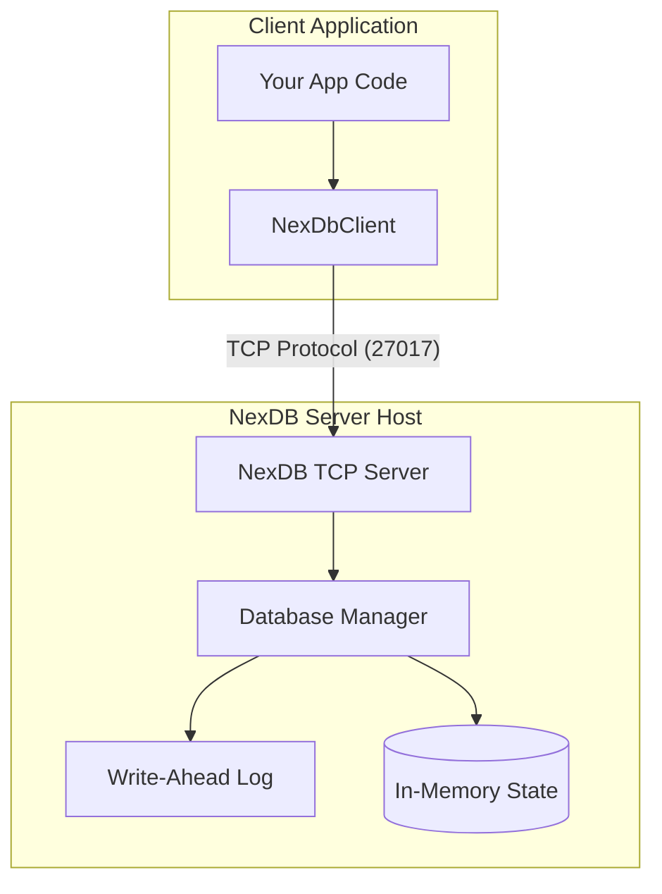

# NexDB Core


NexDB Core is the official Rust implementation of **NexDB** — a high-performance document database engine. It includes the database engine with Write-Ahead Logging (WAL) for durability, B-Tree indexes, and a built-in multi-tenant TCP server process.

---

## Architecture Diagram



---

## Features

- ** Durability**: Write-Ahead Logging (WAL) ensures crash-recovery and transaction safety.
- ** Fast Indexes**: Field-level indexing (including nested fields via dot-notation) using memory B-Trees.
- ** Client-Server Architecture**: Dedicated server daemon (`serve` command) with clients communicating via TCP sockets.
- ** Data Portability**: Export database to JSON, CSV, or standard SQL (PostgreSQL, MySQL, SQLite dialect).
- ** Embedded Support**: Can be optionally linked directly in Rust applications for embedded local file operations.

---

## Installation

Add NexDB to your `Cargo.toml`:

```toml
[dependencies]
nexdb = { git = "https://github.com/Ayushisingh09/NexDB-Core" }
```

---

## Usage

### 1. Database Server Daemon
To host the database, start the TCP listener pointing to a storage directory:
```bash
cargo run --release -- serve ./data_dir --port 27017
```

### 2. Client Connection (CLI REPL)
Connect to the running database server using the connection URL format `nexdb://token@host:port/dbname`:
```bash
cargo run --release -- repl nexdb://secrettoken@127.0.0.1:27017/my_app
```

### 3. Client CLI Commands
Perform single operations over TCP:
```bash
# Insert a document
cargo run --release -- insert nexdb://secrettoken@127.0.0.1:27017/my_app users u101 '{"name":"Ansh","age":24}'

# Query a document
cargo run --release -- get nexdb://secrettoken@127.0.0.1:27017/my_app users u101
```

### 4. Embedded Database Library (Rust Programmatic)
Link the engine directly inside your Rust process (embedded mode):

```rust
use nexdb::{NexDb, Document};

#[tokio::main]
async fn main() -> Result<(), Box<dyn std::error::Error>> {
    // Open/create database files directly
    let db = NexDb::open("./local_db").await?;
    db.create_collection("items").await?;

    // Insert
    let doc = Document::from_json(r#"{"name": "Laptop", "price": 999}"#)?;
    db.insert("items", "item01", doc).await?;

    // Fetch
    let retrieved = db.get("items", "item01").await?;
    println!("Retrieved: {}", retrieved.to_json());
    
    Ok(())
}
```

---

## CLI Command Reference

| Subcommand | Parameters | Description |
| :--- | :--- | :--- |
| `serve` | `<db_dir> [--port N]` | Starts the database host TCP server daemon |
| `repl` | `<connection_url>` | Launches interactive REPL connected to server |
| `insert` | `<connection_url> <col> <id> <json>` | Inserts document via network connection |
| `get` | `<connection_url> <col> <id>` | Gets document matching ID over connection |
| `update` | `<connection_url> <col> <id> <json>` | Replaces document matching ID over connection |
| `delete` | `<connection_url> <col> <id>` | Removes document matching ID over connection |
| `count` | `<connection_url> <col>` | Counts documents inside collection |
| `collections` | `<connection_url>` | Lists all collection names |
| `migrate dump` | `<connection_url> <out_dir>` | Backs up database to JSON files |
| `migrate restore` | `<connection_url> <in_dir>` | Restores database from JSON backup directory |
| `migrate to-sql` | `<connection_url> <dialect>` | Generates a standard SQL schema/insert dump |
| `clean` | `<db_path>` | Deletes database files locally on host server |
