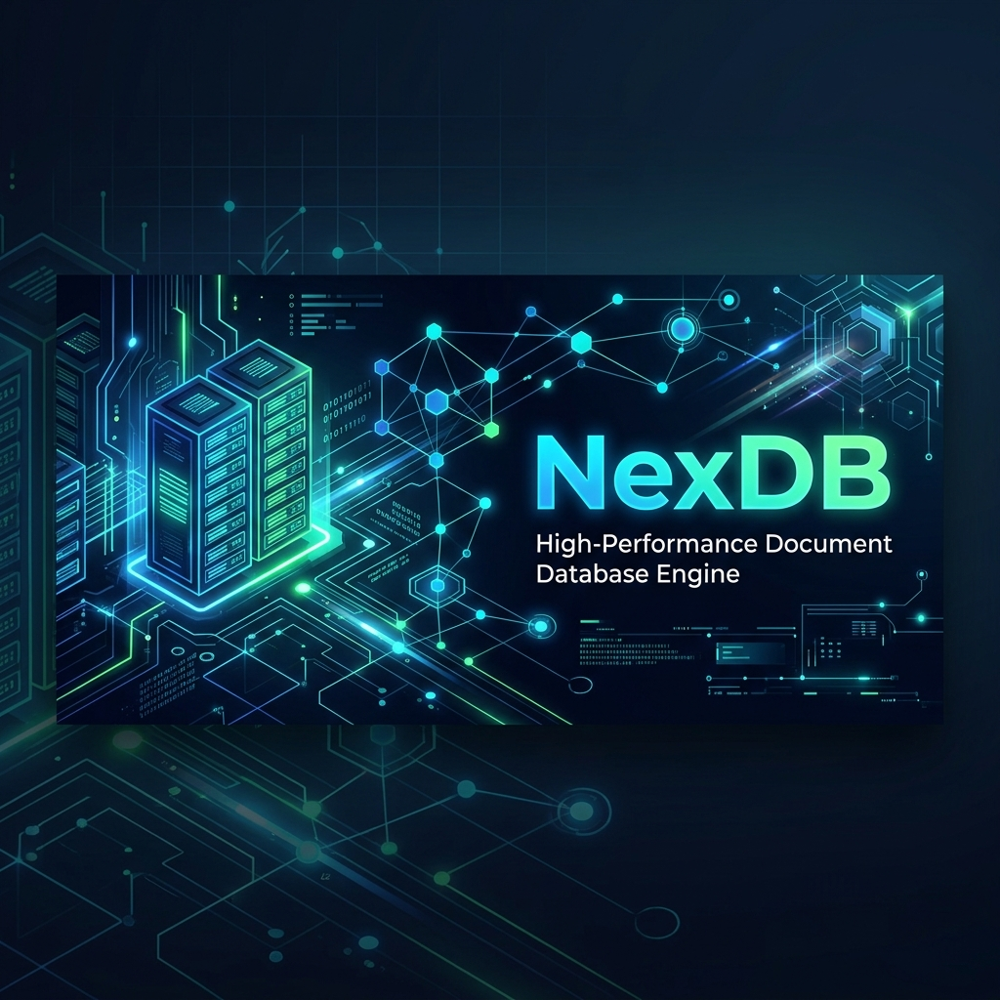
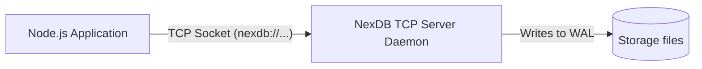

# NexDB Node.js SDK



Official Node.js client library for **NexDB** — a fast, lightweight document database. Connect and query your hosted NexDB server over TCP socket streams with built-in connection pipelining.

---

## Architecture Diagram



---

## Features

- **Asynchronous TCP client**: Communicates via standard TCP sockets.
- **Concurrent Pipelining**: Supports concurrent operations safely over a single network socket stream.
- **Flexible CRUD API**: Straightforward functions for managing document collections.
- **Index Management**: Native calls to build and drop search indexes.

---

## Installation

Install using npm:

```bash
npm install nexdb-sdk
```

---

## Quick Start

Make sure you have a running NexDB server instance. If you don't, you can run one locally:
```bash
# Start server
nexdb serve ./data --port 27017
```

Connect and query:

```javascript
const { NexDbClient } = require('nexdb-sdk');

async function run() {
  // Connection URL format: nexdb://auth_token@host:port/database_name
  const uri = 'nexdb://secrettoken@127.0.0.1:27017/my_app';
  const db = new NexDbClient(uri);
  
  await db.connect();
  console.log("🚀 Connected to NexDB server!");

  // 1. Create a collection
  await db.createCollection('users');

  // 2. Insert a document
  await db.insert('users', 'u101', { 
    name: 'Ansh', 
    role: 'administrator', 
    age: 24 
  });

  // 3. Retrieve a document
  const user = await db.get('users', 'u101');
  console.log('User fetched:', user);

  // 4. Update the document
  await db.update('users', 'u101', { 
    name: 'Ansh', 
    role: 'lead developer', 
    age: 25 
  });

  // 5. Query matching documents
  const admins = await db.find('users', { 
    role: 'lead developer' 
  });
  console.log('Query Results:', admins);

  // 6. Delete a document
  await db.delete('users', 'u101');

  // Clean up connection
  db.close();
}

run().catch(console.error);
```

---

## Method Reference

| Method | Parameters | Return Type | Description |
| :--- | :--- | :--- | :--- |
| `connect()` | *None* | `Promise<void>` | Connects client socket to host server |
| `insert(collection, id, doc)` | `string, string, object` | `Promise<object>` | Inserts document with ID |
| `insertAutoId(collection, doc)` | `string, object` | `Promise<string>` | Inserts document with autogenerated UUID |
| `get(collection, id)` | `string, string` | `Promise<object>` | Fetches document matching ID |
| `update(collection, id, doc)` | `string, string, object` | `Promise<object>` | Updates/replaces document matching ID |
| `delete(collection, id)` | `string, string` | `Promise<object>` | Deletes document matching ID |
| `find(collection, queryObj)` | `string, object` | `Promise<Array>` | Queries documents matching JSON filters |
| `count(collection)` | `string` | `Promise<number>` | Returns document count |
| `createCollection(name)` | `string` | `Promise<object>` | Creates database collection |
| `dropCollection(name)` | `string` | `Promise<object>` | Drops collection from database |
| `createIndex(collection, name, field)` | `string, string, string` | `Promise<object>` | Creates search index on a field path |
| `close()` | *None* | `void` | Closes socket stream connection |
