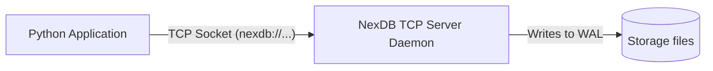

# NexDB Python SDK


Official Python client library for **NexDB** — a high-performance document database engine. Connect and execute queries over safe, lightweight TCP sockets.

---

## Architecture Diagram



---

## Features

- **Standard Socket Client**: Lightweight library with zero external dependencies.
- **Pythonic CRUD API**: Simple, clean interfaces to manage collections and document sets.
- **Index Administration**: Native methods to manage indexes (including nested document structures).
- **Type Safety**: Propagates appropriate exception models for connection or database errors.

---

## Installation

Install using pip:

```bash
pip install nexdb-sdk
```

---

## Quick Start

Make sure you have a running NexDB server instance. If you don't, you can run one locally:
```bash
# Start server
nexdb serve ./data --port 27017
```

Connect and query:

```python
from nexdb import NexDbClient

# Connection URL format: nexdb://auth_token@host:port/database_name
uri = 'nexdb://secrettoken@127.0.0.1:27017/my_app'
db = NexDbClient(uri)

try:
    db.connect()
    print("🚀 Connected to NexDB server successfully!")

    # 1. Create a collection
    db.create_collection('users')

    # 2. Insert a document
    db.insert('users', 'u101', {
        'name': 'Ansh',
        'role': 'administrator',
        'age': 24
    })

    # 3. Retrieve a document
    user = db.get('users', 'u101')
    print('User fetched:', user)

    # 4. Update the document
    db.update('users', 'u101', {
        'name': 'Ansh',
        'role': 'lead developer',
        'age': 25
    })

    # 5. Query matching documents
    results = db.find('users', {
        'role': 'lead developer'
    })
    print('Query Results:', results)

    # 6. Delete a document
    db.delete('users', 'u101')

finally:
    db.close()
```

---

## Method Reference

| Method | Parameters | Return Type | Description |
| :--- | :--- | :--- | :--- |
| `connect()` | *None* | `None` | Connects TCP client socket to server |
| `insert(collection, id, doc)` | `str, str, dict` | `dict` | Inserts document with ID |
| `insert_auto_id(collection, doc)` | `str, dict` | `str` | Inserts document with auto UUID |
| `get(collection, id)` | `str, str` | `dict` | Fetches document matching ID |
| `update(collection, id, doc)` | `str, str, dict` | `dict` | Updates/replaces document matching ID |
| `delete(collection, id)` | `str, str` | `dict` | Deletes document matching ID |
| `find(collection, query_dict)` | `str, dict` | `list` | Queries documents matching JSON filters |
| `count(collection)` | `str` | `int` | Returns document count |
| `create_collection(name)` | `str` | `dict` | Creates database collection |
| `drop_collection(name)` | `str` | `dict` | Drops collection from database |
| `create_index(collection, name, field)` | `str, str, str` | `dict` | Creates search index on a field path |
| `close()` | *None* | `None` | Closes TCP socket stream |
